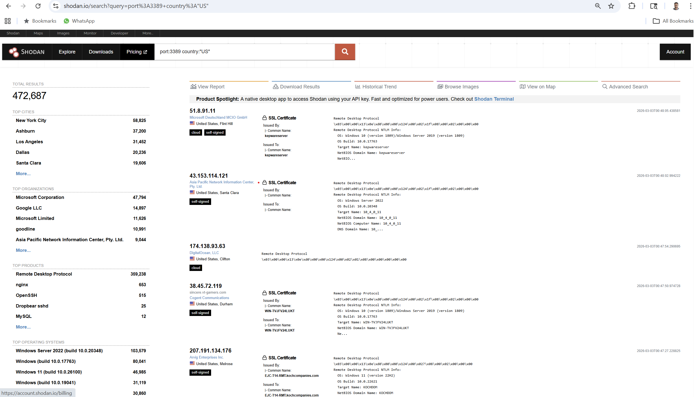
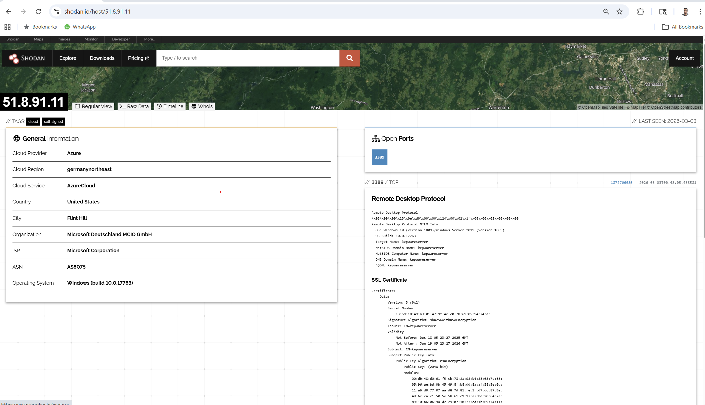
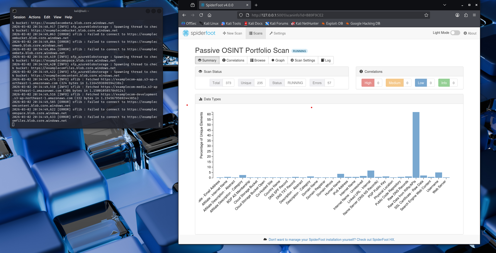
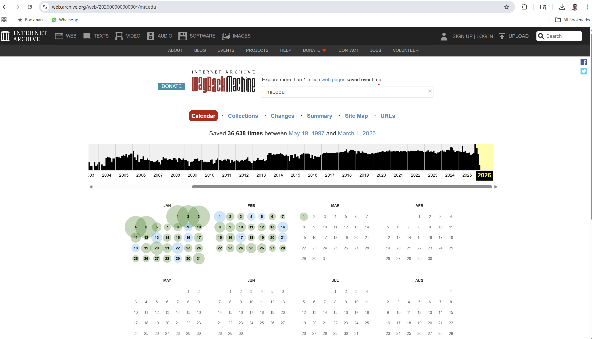

# Passive OSINT Reconnaissance – Public Attack Surface Analysis

## Overview

This project demonstrates passive Open-Source Intelligence (OSINT) techniques used to gather publicly available information about exposed internet-facing services without directly interacting with target systems.

The objective was to understand how attackers can enumerate publicly accessible infrastructure using search engines such as Shodan and Censys, and how exposed service banners contribute to attack surface visibility.

All techniques used were strictly passive and did not involve active scanning or exploitation.

---

## Tools Used

- Shodan (Internet-connected device search engine)
- Censys (Host and service enumeration platform)
- SpiderFoot (Passive OSINT automation framework)
- Wayback Machine (Historical web archive)
- Google Dorking (Advanced search queries)

---

## Methodology

### 1. Service Enumeration Using Shodan

Executed structured queries to identify publicly exposed Remote Desktop Protocol (RDP) services in the United States.

Example query used:
port:3389 country:"US"

This query filters hosts exposing RDP (TCP 3389) within the U.S.

### 2. Banner and Metadata Analysis

Reviewed individual host detail pages to analyze:

- Service banners
- Operating system fingerprints
- SSL certificate metadata
- Internal hostname exposure

### 3. Historical Website Review

Used the Wayback Machine to examine previous versions of websites to identify:

- Infrastructure changes
- Historical exposure
- Technology stack indicators

### 4. Automated Passive Enumeration

SpiderFoot was used to collect:

- DNS information
- Subdomains
- Public email exposure
- Associated metadata

All modules executed were passive-only.

---

## Key Findings

- Identified over 472,000 publicly exposed RDP services within the United States.
- Service banners revealed operating system versions (e.g., Windows Server builds).
- SSL certificate metadata exposed internal hostnames and organizational identifiers.
- Publicly accessible services increase attack surface visibility.
- Aggregated passive data significantly reduces attacker reconnaissance effort.

---

## Security Impact

Exposed RDP services present a significant security risk and are commonly targeted for:

- Brute-force attacks
- Credential stuffing
- Ransomware deployment
- Lateral movement within enterprise networks

Banner information allows attackers to fingerprint operating systems and identify potentially vulnerable versions. SSL certificate metadata may reveal internal naming conventions and system roles.

Organizations should:

- Restrict RDP exposure to VPN-only access
- Disable direct internet-facing RDP services
- Implement multi-factor authentication
- Regularly conduct OSINT self-assessments

---

## Screenshots

### Shodan RDP Exposure Search

### Shodan Host Banner Analysis

### SpiderFoot Enumeration Overview

### Wayback Machine Historical Snapshot

---

## Lessons Learned

- Passive reconnaissance alone provides substantial intelligence about exposed infrastructure.
- Service banners and certificate metadata contribute significantly to attack surface mapping.
- OSINT is a foundational phase in the cyber attack lifecycle.
- Regular external visibility assessments are critical for reducing enterprise risk.

---

## Ethical Considerations

All research was conducted using publicly accessible search engines and passive data aggregation tools. No active scanning, exploitation, or unauthorized interaction with systems was performed.

This project is intended strictly for defensive security analysis and educational purposes.