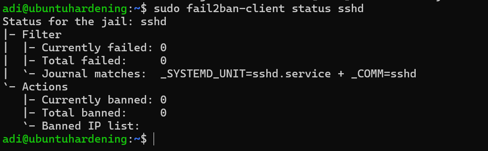

# Linux Server Hardening – SSH Security

## Objective
Hardened an Ubuntu 24.04 server by securing SSH, configuring a firewall, and implementing brute-force protection using Fail2Ban.

---

## 1️⃣ SSH Hardening

- Changed default SSH port from 22 → 2222
- Disabled password authentication
- Enabled key-based authentication
- Restarted SSH service

```bash
sudo nano /etc/ssh/sshd_config
sudo systemctl restart ssh

---

## 📸 Verification Screenshots

### SSH Listening on Port 2222


### UFW Active


### Fail2Ban Running


### SSH Jail Active


---