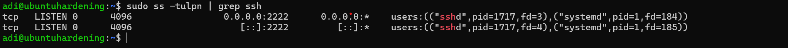
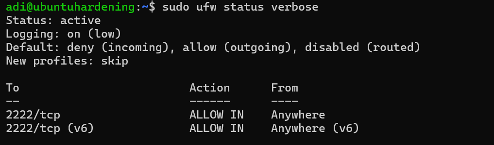
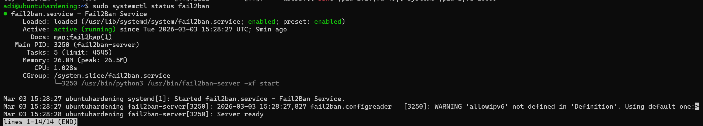

# Linux Server Hardening – SSH Security

## Objective
Hardened an Ubuntu 24.04 server by securing SSH, configuring a firewall, and implementing brute-force protection using Fail2Ban.

---

---

## 🖥 Environment

- OS: Ubuntu 24.04 LTS
- VM Platform: (VMware / VirtualBox / Hyper-V – whichever you used)
- Network: Private LAN (192.168.220.0/24)
- SSH Custom Port: 2222
- Authentication Method: Key-based
- Firewall: UFW
- Intrusion Prevention: Fail2Ban

## 1️⃣ SSH Hardening

- Changed default SSH port from 22 → 2222
- Disabled password authentication
- Enabled key-based authentication
- Restarted SSH service

### Configuration

```bash
sudo nano /etc/ssh/sshd_config
sudo systemctl restart ssh
```

## 🔄 Security Improvements Implemented

| Configuration | Before | After |
|--------------|--------|--------|
| SSH Port | 22 | 2222 |
| Password Login | Enabled | Disabled |
| Firewall | Disabled | Enabled (UFW) |
| Brute Force Protection | None | Fail2Ban |

---

## 🎯 Threat Model

The following threats were considered during this hardening process:

- Automated SSH brute-force attacks
- Credential stuffing attempts
- Port scanning and service enumeration
- Unauthorized remote access attempts

By reducing the exposed attack surface and implementing layered defenses, the server is significantly more resilient against common remote exploitation techniques.

---

## 🛡 Defense-in-Depth Strategy

This configuration applies multiple layers of security:

1. **Service Hardening** – SSH moved off default port.
2. **Authentication Hardening** – Password login disabled.
3. **Network Control** – Firewall restricts inbound access.
4. **Intrusion Prevention** – Fail2Ban monitors and blocks malicious IPs.

Layered controls ensure that failure of one mechanism does not compromise the system.

---

## 📘 Lessons Learned

- Default configurations often prioritize usability over security.
- Moving services off default ports reduces automated attack exposure.
- Firewalls should always be enabled in production environments.
- Automated intrusion prevention reduces manual monitoring effort.
- Security should be implemented in layers (Defense-in-Depth).
---

## 🧾 Verification Screenshots

### ✅ SSH listening on port 2222



### ✅ UFW enabled and active



### ✅ Fail2Ban service running



### ✅ Fail2Ban SSH jail active


---