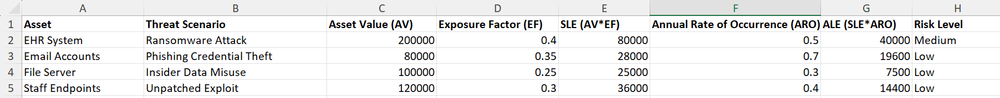
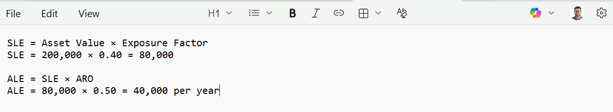

# Risk Analysis Case Study – Small Healthcare Clinic (PHI/PII)

## Objective
Perform a practical risk assessment for a small healthcare clinic handling **PHI/PII**, and recommend controls using **ALE (Annualized Loss Expectancy)** and basic **cost-benefit analysis**.

---

## Scope & Assumptions
- Organization: Small outpatient healthcare clinic (≈30 staff)
- Systems:
  - EHR system (patient records)
  - Windows endpoints for staff
  - File server / shared drive
  - Email (Microsoft 365 or similar)
  - Clinic Wi-Fi + network printer/scanner
- Assumptions:
  - Clinic depends on EHR availability for daily operations
  - Backups exist but may not be tested regularly
  - Staff are not security experts

---

## Assets (What we protect)
| Asset | Why it matters | CIA Priority |
|---|---|---|
| EHR database (PHI) | Legal/regulatory + patient safety | C + I |
| Staff endpoints | Common attack entry point | I + A |
| Email accounts | Phishing delivery + account takeover | C + I |
| Clinic network | Lateral movement risk | A + I |
| Backups | Recovery from ransomware | A |

---

## Threats & Vulnerabilities
### Key Threats
- Phishing → credential theft → mailbox takeover
- Ransomware → EHR outage + data encryption
- Insider misuse (accidental or malicious)
- Unpatched systems → exploitation
- Weak access control / shared accounts

### Key Vulnerabilities
- Password-only logins (no MFA)
- Users have local admin rights
- Limited email filtering and user training
- Infrequent patching (endpoints + server)
- Backups not tested / not offline/immutable
- Flat network (no segmentation)

---

## Top Risk Scenario (Primary)
### Scenario: Ransomware impacts endpoints and encrypts shared drive + EHR access
**Impact:** clinic downtime, patient appointment cancellations, recovery costs, possible data exposure.

---

## Risk Quantification (ALE)
**Formula:**  
- SLE = Asset Value (AV) × Exposure Factor (EF)  
- ALE = SLE × Annual Rate of Occurrence (ARO)

### Estimate Values
- Asset / impact area: Clinic operations + EHR access
- Estimated AV (annual business impact if lost): **$200,000**
- Exposure Factor (portion impacted per incident): **0.40** (40%)
- ARO (likelihood per year): **0.50** (once every ~2 years)

### Calculations
- **SLE = 200,000 × 0.40 = $80,000**
- **ALE = 80,000 × 0.50 = $40,000 / year**

✅ **Estimated Annualized Loss Expectancy (ALE): $40,000/year**

---

## Risk Matrix (Simple)
| Likelihood | Impact | Risk |
|---|---|---|
| Medium | High | High |

---

## Recommended Controls (Defense-in-Depth)
### Preventive Controls
- Enforce **MFA** for email + remote access
- Disable local admin where not needed; use **least privilege**
- Endpoint protection (EDR/AV) + ransomware protection
- Patch management: monthly cycle + critical hotfixes
- Network segmentation (separate clinical devices, printers, guest Wi-Fi)

### Detective Controls
- Central logging (Windows event forwarding / SIEM-lite)
- Email security: phishing detection + link scanning
- Alerts for unusual logins / mailbox forwarding rules

### Corrective Controls
- **Immutable/offline backups** + routine restore testing
- Incident response playbook (ransomware checklist)
- Rapid rebuild procedure for endpoints

---

## Cost-Benefit (Basic)
Assume implementing the following:
- MFA + email security improvements: **$3,000/year**
- Backup hardening (immutable/offline + testing): **$6,000/year**
- Security awareness training: **$1,000/year**
- Total annual control cost: **$10,000/year**

### Comparison
- Current ALE (estimated): **$40,000/year**
- After controls (assume risk reduced by 60%): **New ALE ≈ $16,000/year**
- Risk reduction value: **$24,000/year**
- Net benefit: **$24,000 - $10,000 = $14,000/year**

✅ Controls are justified financially and reduce operational disruption risk.

---

## Validation Evidence (What you’d show in a real assessment)
- Policy screenshots: MFA enforcement, patch policy
- Backup test record (restore proof)
- Risk register (table above) and ALE worksheet
- Incident response checklist

> Note: This is a portfolio case study using realistic assumptions (no real clinic data used).

---

## Lessons Learned
- Risk is not just “threats”—it’s **likelihood × impact**.
- **MFA + backups** provide the best ROI for ransomware risk reduction.
- Security works best as layered controls (prevent, detect, correct).

