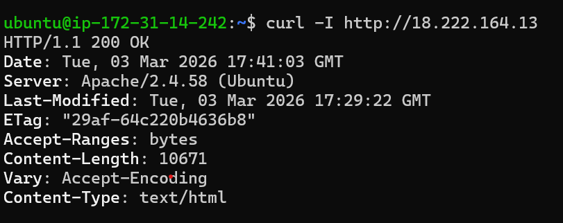
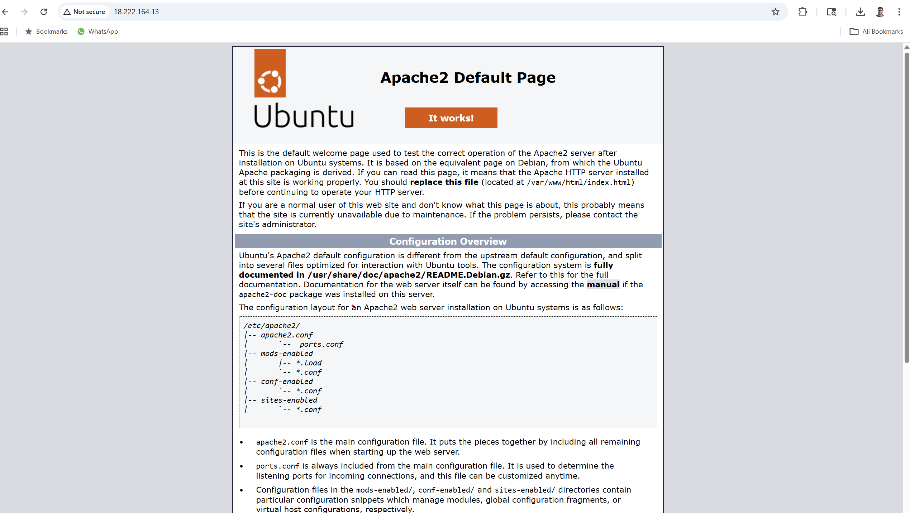
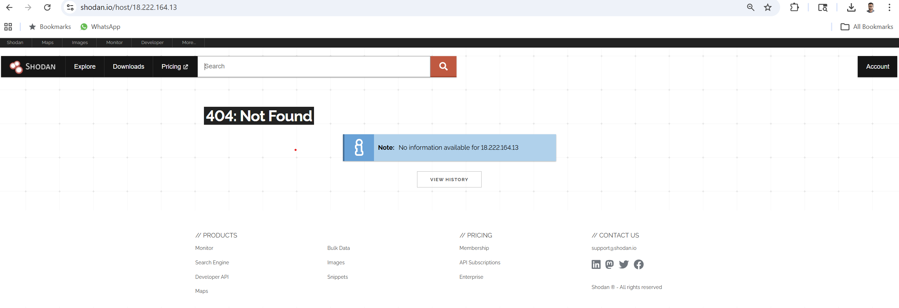

# Cloud Banner Exposure

## Objective

Deployed an Apache web server on AWS EC2 to demonstrate how misconfigured server banners expose sensitive information to the public internet. Used Shodan and curl to discover the exposed banner, then documented the risk and mitigation steps.

---

## Environment

- Cloud Provider: AWS EC2
- OS: Ubuntu 24.04 LTS
- Web Server: Apache 2.4.58
- Instance Type: t2.micro (Free Tier)
- Public IP: 18.222.164.13

---

## Setup

### Apache Installation

```bash
sudo apt update
sudo apt install apache2 -y
sudo systemctl start apache2
sudo systemctl enable apache2
```

### Custom Banner Configuration

Modified `/etc/apache2/conf-available/security.conf`:

```
ServerTokens Full
```

Added to `/etc/apache2/apache2.conf`:

```
ServerSignature On
ServerAdmin AdityaNarasimhan_NEU9265
```

Restarted Apache:

```bash
sudo systemctl restart apache2
```

---

## Banner Verification

### Local Verification (from server)

```
curl -I http://localhost
```

Response headers revealed:

```
Server: Apache/2.4.58 (Ubuntu)
```

### External Verification (from local machine)

```
curl -I http://18.222.164.13
```

Confirmed the same banner is publicly visible from the internet.

---

## Discovery via Shodan

Submitted an on-demand scan to Shodan using the API:

```bash
curl https://api.shodan.io/shodan/scan?key=YOUR_API_KEY -d "ips=18.222.164.13"
```

Shodan had not yet indexed the server at the time of testing. Newly launched instances may take time to appear in Shodan's database.

---

## Risk Analysis

### What Is Exposed

- Apache version (2.4.58)
- Operating system (Ubuntu)
- Server administrator identity (AdityaNarasimhan_NEU9265)

### Why This Is Dangerous

- Attackers can use version information to search for known CVEs and exploits targeting Apache 2.4.58.
- OS identification narrows down the attack surface and helps attackers tailor their approach.
- The ServerAdmin field leaks personally identifiable information.
- Automated scanners like Shodan and Censys continuously index this data, making exposed servers easy to find at scale.

---

## Mitigation

### Recommended Configuration Changes

Modify `/etc/apache2/conf-available/security.conf`:

```
ServerTokens Prod
```

Modify `/etc/apache2/apache2.conf`:

```
ServerSignature Off
ServerAdmin webmaster@localhost
```

Restart Apache:

```bash
sudo systemctl restart apache2
```

After applying these changes, the server header will only show `Server: Apache` with no version or OS details.

---

## Lessons Learned

- Default web server configurations often expose unnecessary information.
- Banner grabbing is one of the first steps in reconnaissance and requires minimal effort from an attacker.
- Reducing information disclosure is a simple but effective hardening measure.
- Cloud instances are especially vulnerable because they are publicly accessible by default.
- Tools like Shodan and Censys make it trivial to discover misconfigured servers at scale.

---

## Screenshots

### Banner from curl (localhost)



### Banner from curl (external)



### Shodan Discovery Attempt



---